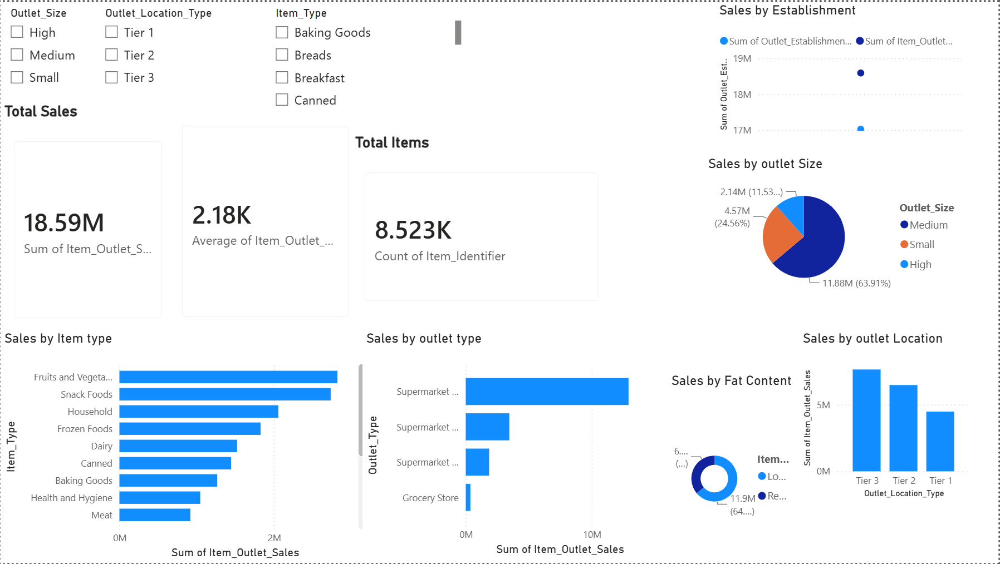

Blinkit Retail Sales Analytics Dashboard

This is an end-to-end Data Analytics project where I analyzed Blinkit's retail sales data using Python, SQL, and Power BI.

The project includes data cleaning, exploratory data analysis, SQL queries, and an interactive Power BI dashboard to identify sales trends and business insights.

## What this project does

- Cleans and preprocesses the retail sales dataset
- Performs Exploratory Data Analysis (EDA)
- Analyzes sales data using SQL
- Creates an interactive Power BI dashboard
- Provides business insights through visualizations

## Dashboard Includes

- Total Sales
- Average Sales
- Total Items Sold
- Sales by Item Type
- Sales by Fat Content
- Sales by Outlet Size
- Sales by Outlet Location
- Sales by Outlet Type
- Sales by Outlet Establishment Year
- Interactive slicers for filtering data

## Technologies Used

- Python
- Google Colab
- Pandas
- NumPy
- Matplotlib
- MySQL
- Power BI
- Git
- GitHub

## Project Structure

```
Blinkit-Retail-Sales-Analytics/

data/
├── blinkit.csv
├── blinkit_cleaned.csv

notebook/
├── Blinkit_Retail_Sales_Analytics.ipynb

sql/
├── blinkit_analysis.sql

powerbi/
├── Blinkit_Dashboard.pbix

images/
├── dashboard.png

README.md
```

## Dashboard Preview



## How to run this project

Clone the repository:

```bash
git clone https://github.com/sai-dhanush09/Blinkit-Retail-Sales-Analytics.git

cd Blinkit-Retail-Sales-Analytics
```

Open the notebook in Google Colab and run all the cells.

Execute the SQL queries in MySQL.

Open `Blinkit_Dashboard.pbix` in Power BI Desktop to explore the dashboard.
